# 📊 SDM - Sistema Inteligente para Detecção de Microgastos


Solução avançada de análise de extratos financeiros desenvolvida para identificar, categorizar e monitorar microgastos em transações bancárias. O sistema processa entradas em múltiplos formatos, aplica regras de mineração contextual (Regex) e gera indicadores de *Business Intelligence* precisos para otimização do controle financeiro pessoal.

## 📑 Índice
- [Autores](#-autores)
- [Funcionalidades Principais](#-funcionalidades-principais)
- [Capturas de Tela](#-capturas-de-tela)
- [Arquitetura do Sistema](#-arquitetura-do-sistema)
- [Stack Tecnológica](#️-stack-tecnológica)
- [Instalação e Execução Local](#-instalação-e-execução-local)
- [Guia Rápido de Uso](#-guia-rápido-de-uso)
- [Limitações Conhecidas](#️-limitações-conhecidas)
- [Roadmap](#-roadmap--trabalhos-futuros)
- [Licença Acadêmica](#-licença-acadêmica)

## 👥 Autores
- **Mateus Santos Moreira** — Sistemas de Informação
- **Sarah Costa Silva** — Sistemas de Informação

---

## 🚀 Funcionalidades Principais

- **Autenticação e Segurança (Multi-tenant):** Sistema de login com criptografia de senhas e isolamento de dados por usuário (*Privacy by Design*), totalmente alinhado aos preceitos da LGPD.
- **Ciclo Completo de Credenciais:** Cadastro com confirmação de conta por e-mail, redefinição de senha ("Esqueci minha senha") via link temporário e exclusão definitiva de conta pelo próprio usuário — ciclo de vida completo da credencial, do cadastro à remoção.
- **UI/UX Premium (Tema Claro/Escuro):** Interface com alternância dinâmica entre Modo Escuro e Modo Claro — incluindo os gráficos analíticos (Plotly) e os componentes internos do Streamlit — projetada com os mesmos padrões de usabilidade de painéis avançados de BI do mercado.
- **Extração Universal (ETL):** Ingestão e processamento em memória de extratos nos formatos PDF, CSV e JSON de diversas instituições bancárias.
- **Categorização Heurística (Sistema Especialista):** Motor de regras baseado em Regex Contextual e listas de palavras-chave que extrai e pré-categoriza transações em documentos não estruturados. É uma abordagem de IA simbólica clássica (sistema baseado em regras, escritas pelos autores) — **não emprega Machine Learning nem modelos treinados** nesta versão do protótipo.
- **Auditoria Humana Integrada (*Human-in-the-loop*):** Interface interativa (*Data Grid*) que permite ao usuário validar e editar categorias antes da geração de relatórios, garantindo a precisão final dos dados.
- **Formulários Ágeis:** Telas de login, cadastro e redefinição de senha aceitam envio via tecla **Enter**, sem necessidade de clicar no botão.
- **Cálculo de Comprometimento (IM):** Métrica exclusiva para mensurar matematicamente o impacto da "bola de neve" dos pequenos gastos na renda mensal.
- **Diagnóstico Personalizado:** Card de feedback dinâmico que classifica o cenário financeiro do usuário (Positivo / Atenção / Risco) e sugere uma dica prática de acordo com a categoria de maior impacto no período.
- **Persistência em Nuvem e Histórico Evolutivo:** Banco de dados integrado via **Supabase (PostgreSQL)**, gerando gráficos automatizados de evolução temporal mês a mês.
- **Comparativo Categórico Mensal:** Gráfico de barras agrupadas que evidencia, mês a mês, qual categoria de despesa mais cresceu — permitindo identificar tendências de consumo ao longo do tempo.

---

## 📸 Capturas de Tela

### Autenticação

<table>
<tr>
<td width="50%">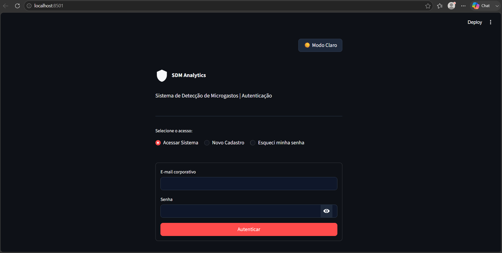<br/><sub>Login — modo escuro (padrão)</sub></td>
<td width="50%">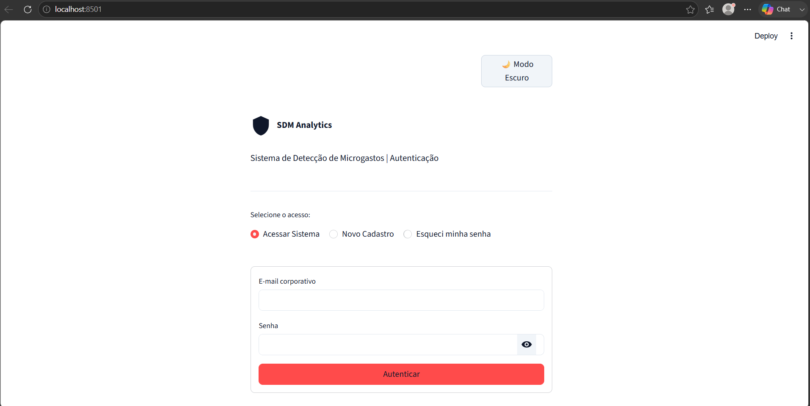<br/><sub>Login — modo claro</sub></td>
</tr>
<tr>
<td width="50%">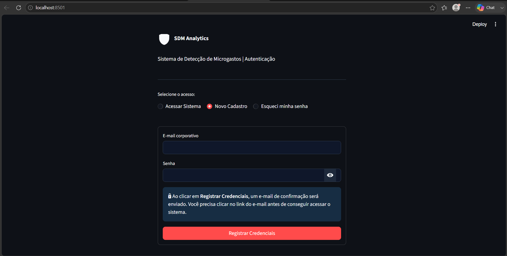<br/><sub>Cadastro com confirmação por e-mail</sub></td>
<td width="50%">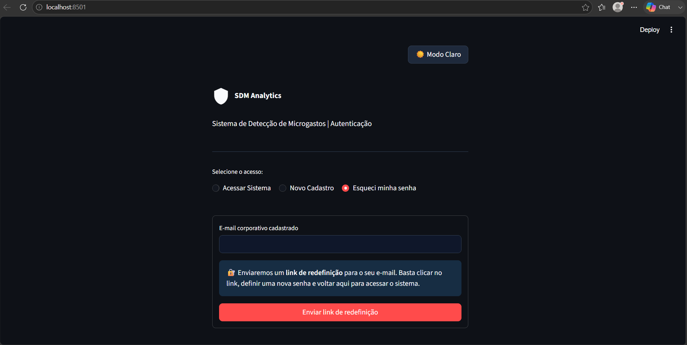<br/><sub>Redefinição de senha</sub></td>
</tr>
</table>

### Ingestão e Auditoria

<table>
<tr>
<td width="50%">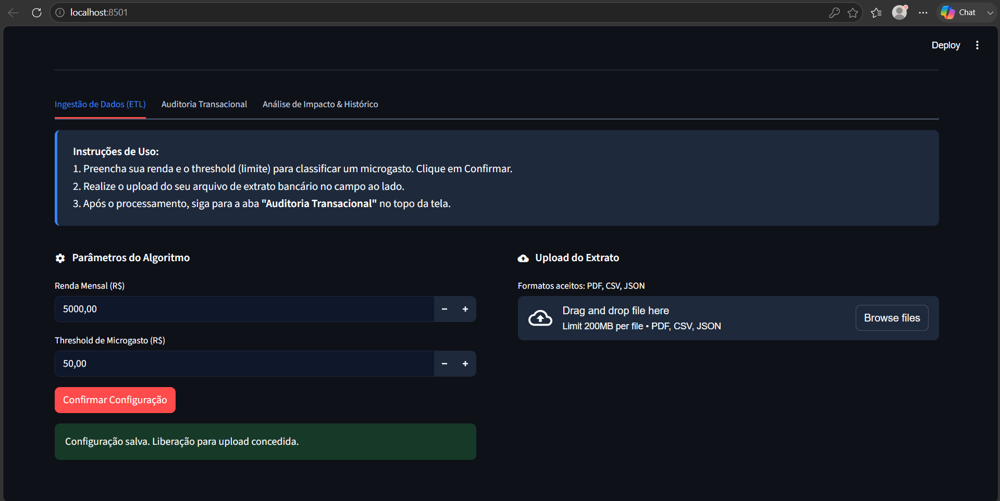<br/><sub>Ingestão de Dados (ETL)</sub></td>
<td width="50%">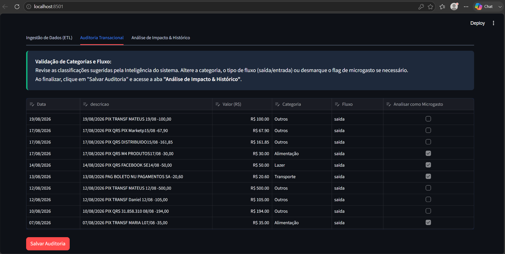<br/><sub>Auditoria Transacional (human-in-the-loop)</sub></td>
</tr>
</table>

### Análise de Impacto & Histórico

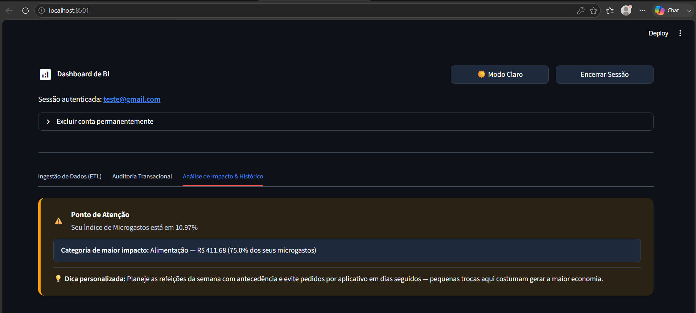
<p><sub>Diagnóstico personalizado por categoria</sub></p>

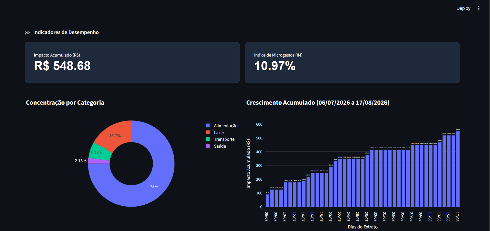
<p><sub>Distribuição por categoria e crescimento acumulado</sub></p>

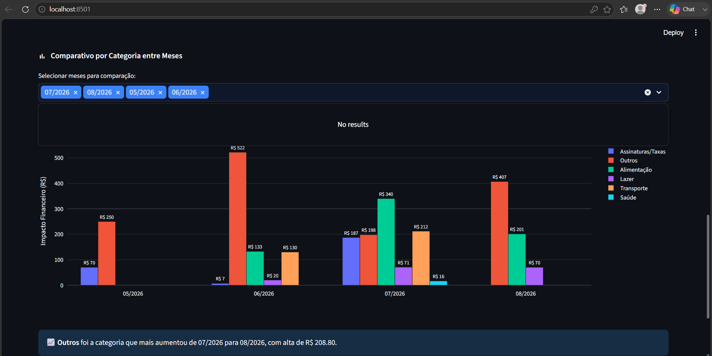
<p><sub>Comparativo de microgastos por categoria entre meses</sub></p>

### Gerenciamento de Conta

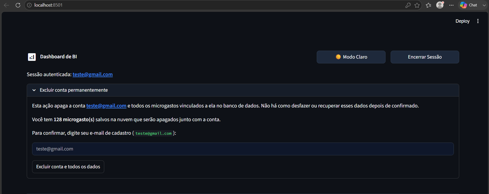
<p><sub>Exclusão de conta com confirmação por e-mail digitado</sub></p>

---

## 📊 Arquitetura do Sistema

O projeto adota um padrão arquitetural modular, separando a lógica de negócio, a visualização e a persistência de dados:

1. **`app.py` (View / Frontend):** Interface do usuário em Streamlit responsável pelo roteamento (Login/Cadastro/Reset/App), alternância de tema, inputs numéricos de alta precisão, auditoria humana e renderização de *dashboards* limpos.
2. **`analyzer.py` (Controller / Engine):** Motor de mineração e processamento de dados. Contém as heurísticas de Regex, normalização de *DataFrames* e a lógica do sistema especialista gerador de "Planos de Ação".
3. **`database.py` (Model / Integração):** Camada de segurança e banco de dados. Gerencia a comunicação com a API do Supabase — login, cadastro, redefinição de senha, exclusão de conta e persistência de microgastos — utilizando *JSON Web Tokens* (JWT) para garantir que cada usuário só acesse seus próprios dados.

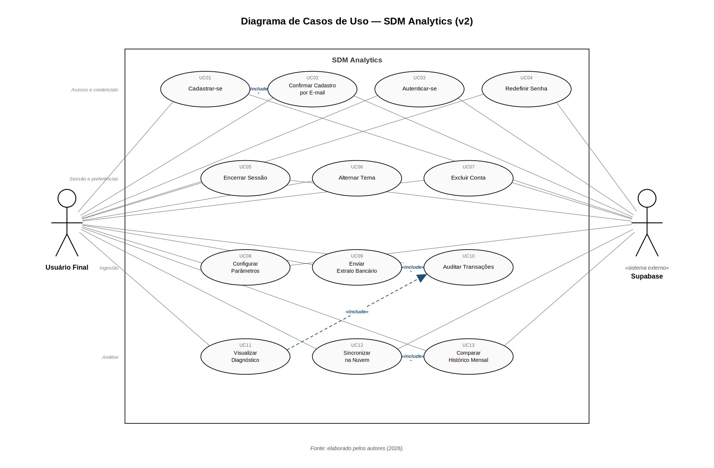
<p><sub>Diagrama de Casos de Uso (UML)</sub></p>

### Modelo de Dados

O banco relacional (PostgreSQL/Supabase) é composto por duas entidades principais — `usuarios` e `microgastos` — em um relacionamento 1:N, com isolamento de dados garantido por Row-Level Security.

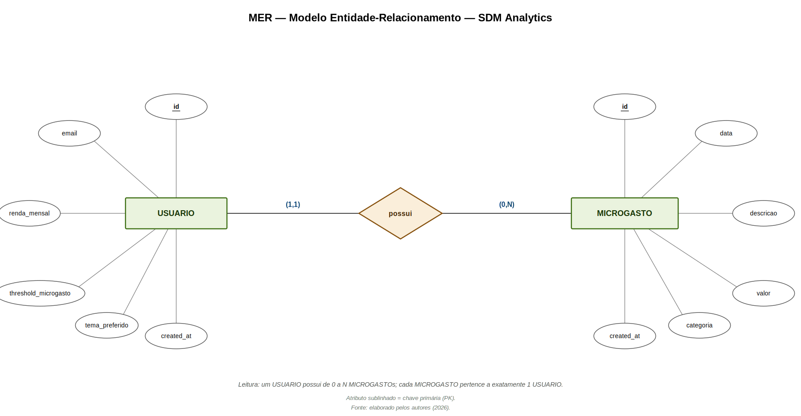
<p><sub>MER — Modelo Entidade-Relacionamento (notação de Chen)</sub></p>

---

## 🛠️ Stack Tecnológica

| Componente | Tecnologia | Função |
| :--- | :--- | :--- |
| **Linguagem Base** | [Python 3.x](https://www.python.org/) | Backend, Engenharia de Dados e Lógica |
| **Interface (UI)** | [Streamlit](https://streamlit.io/) | Criação do Dashboard Web SPA (*Single Page Application*) |
| **Data Engine** | [Pandas](https://pandas.pydata.org/) | Manipulação, limpeza e agregação dos DataFrames |
| **Visualização (BI)** | [Plotly](https://plotly.com/python/) | Renderização de gráficos dinâmicos de alta legibilidade |
| **Cloud DB & Auth**| [Supabase](https://supabase.com/) | Autenticação (BaaS) e persistência relacional PostgreSQL |
| **PDF Mining** | [PyPDF](https://pypdf.readthedocs.io/) | Leitura e extração binária de documentos não estruturados |
| **Segurança** | JWT + Row-Level Security (RLS) | Emissão de tokens de sessão e isolamento de dados por usuário no PostgreSQL |

---

## 📦 Instalação e Execução Local

1. Clone o repositório para a sua máquina:
```bash
git clone https://github.com/MateusMoreira1/tcc-sistema-deteccao-microgastos.git
cd tcc-sistema-deteccao-microgastos
```

> 📁 As imagens deste README ficam em `docs/screenshots/` (capturas de tela do sistema) e `docs/diagramas/` (MER e diagrama de casos de uso). Ambas as pastas já acompanham o repositório.

2. Crie e ative o ambiente virtual Python (Recomendado):
```bash
python -m venv .venv

# Ativação no Windows:
.venv\Scripts\activate

# Ativação no Linux/Mac:
source .venv/bin/activate
```

3. Instale as dependências listadas:
```bash
pip install -r requirements.txt
```

4. **Configuração de Variáveis de Ambiente (Segurança):**
Crie uma pasta oculta chamada `.streamlit` na raiz do projeto e, dentro dela, um arquivo `secrets.toml`. Adicione suas credenciais do Supabase neste arquivo:
```toml
# Arquivo: .streamlit/secrets.toml
SUPABASE_URL = "SUA_URL_AQUI"
SUPABASE_KEY = "SUA_CHAVE_AQUI"
```

5. **Configuração do Supabase (painel web):**
No painel do seu projeto Supabase, ajuste:
   - `Authentication → Providers → Email` → ative **"Confirm email"** para exigir confirmação de conta por e-mail no cadastro.
   - `Authentication → URL Configuration` → configure **Site URL** e **Redirect URLs** com a URL onde a aplicação está publicada (ex.: `https://seu-app.streamlit.app`), para que os links de confirmação de cadastro e de redefinição de senha funcionem corretamente.
   - `SQL Editor` → execute o script abaixo **uma única vez**, para habilitar a exclusão de conta pelo próprio usuário:

```sql
create or replace function delete_own_account()
returns void
language plpgsql
security definer
set search_path = public
as $$
begin
  delete from public.microgastos where usuario_id = auth.uid()::text;
  delete from auth.users where id = auth.uid();
end;
$$;

grant execute on function public.delete_own_account() to authenticated;
```

   > ⚠️ O plano gratuito do Supabase limita o envio de e-mails a aproximadamente **3 por hora** (cadastro + redefinição de senha). Planeje testes e demonstrações considerando esse limite.

6. Inicie a aplicação:
```bash
streamlit run app.py
```

---

## 📋 Guia Rápido de Uso

1. **Acesso:** Na tela inicial, crie uma conta com senha segura (mín. 6 caracteres), faça login, ou utilize a opção **"Esqueci minha senha"** caso necessário.
2. **Parametrização:** Informe sua Renda Mensal e defina numericamente o limite de corte do que deve ser considerado um "Microgasto".
3. **Ingestão:** Faça o upload do arquivo do extrato (PDF, CSV ou JSON).
4. **Auditoria:** Revise as sugestões do motor heurístico de categorização na tabela. Altere categorias usando o menu suspenso, se necessário.
5. **Business Intelligence:** Acesse a aba "Análise de Impacto & Histórico" para ver o card de diagnóstico personalizado (categoria de maior impacto e dica prática), o comparativo de categorias entre meses, e clicar em **Persistir Dados** para alimentar seu histórico evolutivo na nuvem.
6. **Gerenciamento de conta:** No topo do dashboard, a seção **"Excluir conta permanentemente"** exibe a quantidade real de microgastos salvos e exige que você digite o e-mail da conta para confirmar — evitando exclusões acidentais.

---

## ⚠️ Limitações Conhecidas

- O sistema **não utiliza Machine Learning ou IA generativa**. A categorização e classificação de fluxo são feitas por heurística de palavras-chave (regras fixas, escritas pelos autores).
- Extratos protegidos por senha ou digitalizados como imagem (sem OCR) não são processados.
- A categorização automática está limitada a seis categorias fixas.
- A tabela de auditoria (*Data Grid*) tem usabilidade reduzida em telas de toque (dispositivos móveis).
- Autenticação por código enviado ao e-mail (OTP) foi avaliada durante o desenvolvimento, mas não incorporada, em razão do limite de envio de e-mails do plano gratuito do Supabase.
- A exclusão de conta depende de uma função SQL com privilégio elevado (`SECURITY DEFINER`) criada previamente no banco — o cliente Python usa apenas a chave anônima e não tem permissão para excluir usuários diretamente, por design de segurança do Supabase.

## 🔭 Roadmap / Trabalhos Futuros

- Integração com **Open Finance**, substituindo o upload manual por consumo direto de APIs bancárias.
- Incorporação de **Machine Learning preditivo** para antecipar meses de maior risco de microgastos.
- Interface otimizada para dispositivos móveis (*mobile-first*).

---

## 📝 Licença Acadêmica
Este projeto foi desenvolvido integralmente como Trabalho de Conclusão de Curso (TCC) do curso de Sistemas de Informação. Uso, cópia e distribuição são permitidos para fins estritamente acadêmicos, mediante a citação obrigatória dos autores originais.
